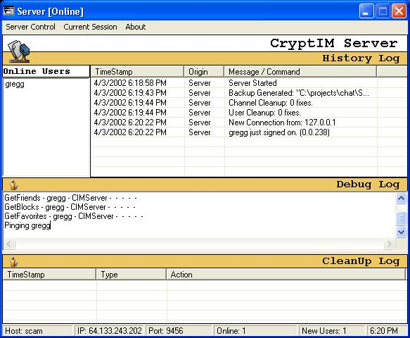

<div align="center">

## CryptIM: Instant Messaging and Multi\-user chat system\. \(client and server\.\)


</div>

### Description

CryptIM is a fully encrypted chat system. It is the most complete IM and multi-user chat (irc like) chat system on planet source code. It has many features, to many to list here. Currently is 1 public t1 (dedicated) server up. More on the way. Some features listed below, more on the homepage http://sc.am/cryptim/chat.zip
 
### More Info
 


<span>             |<span>
---                |---
**Submitted On**   |
**By**             |[Gregg Housh](https://github.com/Planet-Source-Code/PSCIndex/blob/master/ByAuthor/gregg-housh.md)
**Level**          |Intermediate
**User Rating**    |4.4 (40 globes from 9 users)
**Compatibility**  |VB 6\.0
**Category**       |[Complete Applications](https://github.com/Planet-Source-Code/PSCIndex/blob/master/ByCategory/complete-applications__1-27.md)
**World**          |[Visual Basic](https://github.com/Planet-Source-Code/PSCIndex/blob/master/ByWorld/visual-basic.md)
**Archive File**   |[](https://github.com/Planet-Source-Code/gregg-housh-cryptim-instant-messaging-and-multi-user-chat-system-client-and-server__1-50613/archive/master.zip)


### Source Code

```
http://sc.am/cryptim/chat.zip
Some of the features:
* IM's
* Multi-user irc like chat With user modes, topics, bans, and channel modes.
* A Channel services system For the irc-like chat (works like a bot on irc would, but built into the server)
* Away mode With away messages.
* Friends, Blocks, and Favorite channels list all stored On the server so you have the same lists no matter where you login from.
* Window docking and stay On top.
* Many options on the Server and Client.
* The server supports all kinds of logging features.
* Auto-backup of every configuration setting, including users on an hourly basis.
* New user signup uses a password On the server.
* Client can remotely change the users password.
* Client and Server both have "keep-alive" code. They both make timed ping/pong's To the server (irc talk). This means that every 45 seconds the server sends a PING command to a client. Then the client sends the same command to the server. This helps keep the connection from timing out on isp's that Do that sort of thing.
* Many "User Cleanup" options. These allow you To go through the user list and clear out accounts that need to be deleted or frozen. Using simple rules like: Anyone who hasnt signed on in 6 months.
* The server supports permanent channels/rooms now. Server admins can add channels that will be there at all times, whether they have users in them or not.
* The client has sounds, and they are just wav files so you can replace them With whatever sounds you might want.
* Delayed signoff/signon like AIM (this is what I call it when the person signs on and the icon changes and waits a second, so you can see who it was that signed on.)
* Auto-join favorite channels On signon
* The client uses the winsock api, the server uses the winsock control. So you can Get examples of both.
* The server has been hit as hard as can be To find holes and bugs and all that have bee found security wise have been fixed.
* Server administrators can freeze accounts With a reason that is told to the user when they try and sign on.
* Server administrators can ban ip's.
* Server administrators can ban channel names, and key words in channels to block names that might contain language they would rather Not see.
* Users who are Set away show up as a different color In the user list (blue)
* Client and Server both minimize To the tray.
* much more...
This is still under heavy development, new features and bug hunting going On every day. It is still considered alpha. I hope To have it ready to be tagged as beta 1 within 2 months.
(the screenshot is just of the server)
I would post the source here but too many people dont like reading the
readme.txt file and dont compile the few ocx's and dll's that CryptIMs source code uses.
This results In many (last time almost 150)
emails asking me why it isnt working, from people who obviously have no clue.
I really like posting my code here. This site is a great resource.
I just cant take all those emails so I wont put the code here.
Instead you may Get the code With the compiled support files
(it also comes With their source so you can look at the code or re-compile it If you want)
from my website: http://sc.am/cryptim/chat.zip
```

